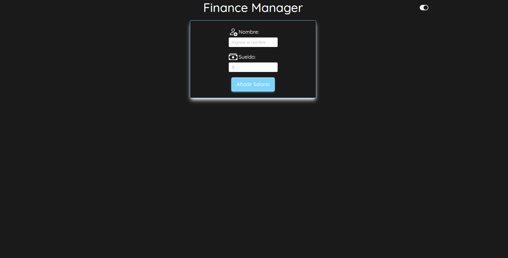
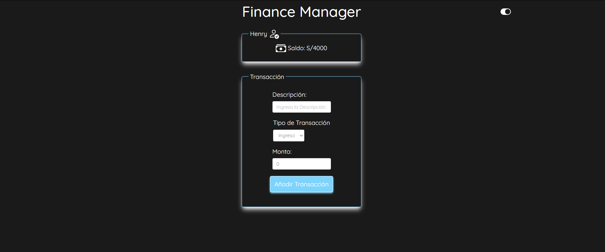

# Finance Manager

**Finance Manager** es una aplicación web diseñada para ayudar a los usuarios a gestionar sus finanzas personales de manera eficaz. Permite un seguimiento detallado de ingresos y egresos, facilitando así una mejor planificación financiera y toma de decisiones. A continuación, se detallan las características principales y cómo utilizar la aplicación.

## Características Principales

- **Gestión de Ingresos y Egresos:** Registra y categoriza tus ingresos y gastos para tener un control detallado de tus finanzas.
- **Interfaz Intuitiva:** La aplicación cuenta con una interfaz amigable y fácil de usar, diseñada para facilitar la gestión financiera.
- **Visualización de Transacciones:** Visualiza tus transacciones recientes y su impacto en tu economía a través de una interfaz clara y gráficos informativos.

## Stack Tecnológico

Este proyecto ha sido desarrollado utilizando las siguientes tecnologías y herramientas:

- **React:** Biblioteca de JavaScript para construir interfaces de usuario.
- **TypeScript:** Superset de JavaScript que añade tipado estático al lenguaje, mejorando el desarrollo y mantenimiento del código.
- **Zustand:** Biblioteca de gestión de estados para aplicaciones React, utilizada para manejar el estado global de la aplicación de manera eficiente.
- **Victory:** Una biblioteca de React para construir gráficos, usada para crear las visualizaciones de datos financieros.
- **Sonner:** Componente opinado de notificaciones para React, diseñado para ofrecer una forma elegante y coherente de presentar mensajes y alertas a los usuarios.

## Cómo Empezar

### Pantalla Principal

En la pantalla principal, debes introducir tu nombre y salario. Esto personaliza tu experiencia y ajusta la aplicación a tus necesidades financieras específicas.

### Formulario de Gastos e Ingresos

Aquí puedes agregar detalladamente todos tus ingresos y egresos. La aplicación permite categorizar cada transacción para un análisis más fino de tus finanzas.

### Previsualización de Transacciones y su Porcentaje

Esta sección ofrece una vista rápida de tus transacciones más recientes junto con una representación gráfica de cómo cada una afecta el total de tus finanzas. Es una herramienta poderosa para entender el impacto de tus hábitos de gasto en tiempo real.

## Contribuir

Este proyecto está abierto a contribuciones. Si eres un desarrollador interesado en mejorar **Finance Manager**.
